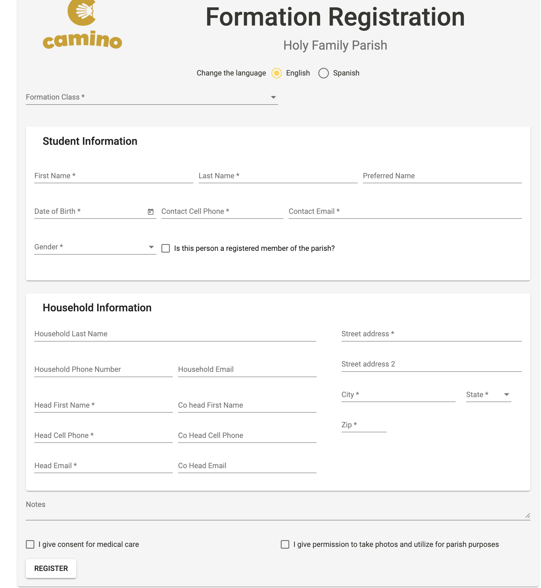

# FaithFormationRegistrationPage Requested Changes (English Page)

1.  `Parishioner membership status`: Update check-box label from "Is this person a current member of the parish?" to "Is this person a registered member of the parish?"
```html
<span class="mat-checkbox-label"><span style="display: none;">&nbsp;</span>Is this person a registered member of the parish?</span> <!--TODO: Changed "Is this person a current member of the parish?" to "Is this person a registered member of the parish?"-->
```

2. Re-word `Medical Attention` consent clause:
```html
<span class="mat-checkbox-label"><span style="display: none;">&nbsp;</span>I give consent for medical care</span> <!--TODO: Changed "Consent for medical care" to "I give consent for medical care"-->
```

3. Re-word `Photo Consent` clause:
```html
<span class="mat-checkbox-label"><span style="display: none;">&nbsp;</span>I give permission to take photos and utilize for parish purposes</span> <!--TODO: Changed "Permission to take photos" to "I give permission to take photos and utilize for parish purposes"-->

```

## The Updated Page Should Look as Follows:


