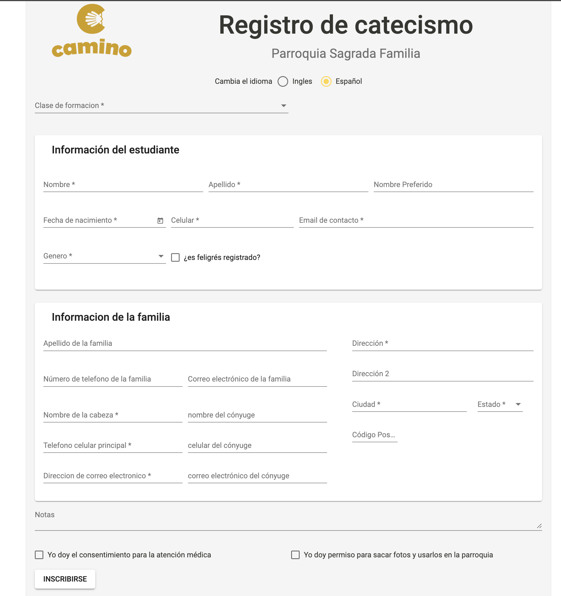

# FaithFormationRegistrationPage Requested Changes (Spanish Page)

1.  At top, “Registro de Catecismo” and “clase de catecismo” // ~lines 2088 - 2089

```html
<div _ngcontent-rpt-c89="" fxlayout="column" fxflex="1 1 80%" fxflex.sm="1 1 80%" fxflex.xs="1 1 100%"
    style="flex-direction: column; box-sizing: border-box; display: flex; flex: 1 1 100%; max-width: 80%;">

    <mat-card-title _ngcontent-rpt-c89="" class="mat-card-title">Registro de catecismo</mat-card-title> <!--TODO: Changed from "Registro de formacion" to "Registro de catecismo"-->
    <mat-card-subtitle _ngcontent-rpt-c89="" class="mat-card-subtitle">Parroquia Sagrada Familia</mat-card-subtitle> <!--TODO: Changed from "Holy Family Parish" to "Parroquia Sagrada Familia"-->
</div>
```

2. `Genero` drop-down items need to be updated:

```html
<div cdk-overlay-origin="" class="mat-select-trigger ng-tns-c106-8">
    <div class="mat-select-value ng-tns-c106-8" id="mat-select-value-3">
        <span class="mat-select-placeholder ng-tns-c106-8 ng-star-inserted">Genero</span>
        <!----><!---->
    </div>
    <div class="mat-select-arrow-wrapper ng-tns-c106-8"><div class="mat-select-arrow ng-tns-c106-8"></div></div> <!--TODO: This drop-down should display two options: "Femenino" & "Masculino". It currently displays "Masculino" & "Mujer"-->
</div>
```

3. Correct checkbox label:

```html
<span class="mat-checkbox-label"><span style="display: none;">&nbsp;</span>¿es feligrés registrado?</span> <!--TODO: Updated text from "?esta feligrés?" to "¿es feligrés registrado?"-->
```

4. Re-word `Household Information (Informacion del hogar)` section labels:
```html
<div _ngcontent-egv-c169="" class="mt-16" style="flex-direction: row; box-sizing: border-box; display: flex;">
    ...
    <mat-card-header _ngcontent-egv-c169="" class="mat-card-header">
        <div class="mat-card-header-text"><mat-card-title _ngcontent-egv-c169="" class="mat-card-title"> Información de la familia </mat-card-title></div> <!--TODO: "Informacion del hogar" changed to "Información de la familia"-->
    </mat-card-header>

    ...

    <span class="ng-tns-c70-9 ng-star-inserted">Apellido de la familia</span> <!--TODO: Changed "Appellido del hogar" with "Apellido de la familia"-->

    ...

    <span class="ng-tns-c70-17 ng-star-inserted">Número de telefono de la familia</span> <!--TODO: Changed "Numero de telefono del hogar" to "Número de telefono de la familia"-->

    ...

    <span class="ng-tns-c70-10 ng-star-inserted">Correo electrónico de la familia</span> <!--TODO: Changed "Correo electronico del hogar" to "Correo electrónico de la familia"-->

    ...
</div>

```

5. Re-word `Medical Attention` consent clause:
```html
<span class="mat-checkbox-label"><span style="display: none;">&nbsp;</span>Yo doy el consentimiento para la atención médica</span> <!--TODO: Changed "Consentimiento para la atencion medica" to "Yo doy el consentimiento para la atención médica"-->
```

6. Re-word `Photo Consent` clause:
```html
<span class="mat-checkbox-label"><span style="display: none;">&nbsp;</span>Yo doy permiso para sacar fotos y usarlos en la parroquia</span> <!--TODO: Changed "Permiso para tomar fotos" to "Yo doy permiso para sacar fotos y usarlos en la parroquia"-->
```

7. Update `SUBMIT` button label:
```html
<div _ngcontent-egv-c169="" fxlayout="row" fxlayoutgap="10px" fxflex="" style="flex-direction: row; box-sizing: border-box; display: flex; flex: 1 1 1e-9px;">
    <button _ngcontent-egv-c169="" type="submit" mat-raised-button="" class="mat-focus-indicator mat-raised-button mat-button-base">
        <span class="mat-button-wrapper"> INSCRIBIRSE </span><span matripple="" class="mat-ripple mat-button-ripple"></span><span class="mat-button-focus-overlay"></span> <!--TODO: changed button label from "REGISTRARSE" to "INSCRIBIRSE"-->
    </button>
</div>
```

## The Updated Page Should Look as Follows:

